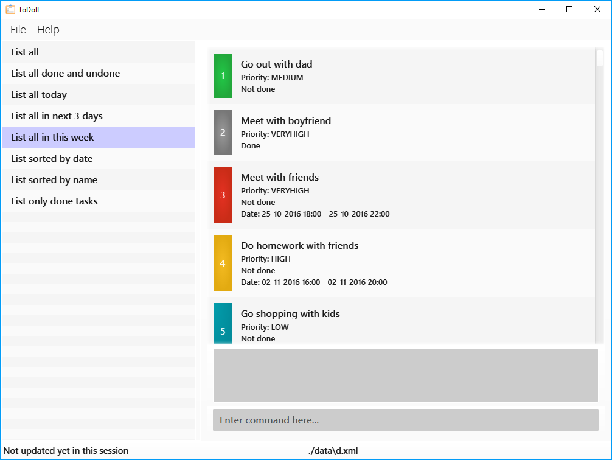

# ToDoIt Task Manager

 

Always forgetting what to do? If you would like to plan your day efficiently, then we have got just the app just for you, ToDoIt! 
 
ToDoIt is a task manager that keeps your daily activities in check. 
It will notify you what is the upcoming activities for the day or the week. 
 
Unlike other task managers, ToDoIt is a simple task manager where everything is done in just one line. 
It has the capabilities of any calendar, but with a more user-friendly interface.
The interface is simple requiring minimal number of steps to accomplish everything. 
 
Are you ready? Let's start now! 

  
#### Site Map
* [User Guide](docs/UserGuide.md) 
* [Developer Guide](docs/DeveloperGuide.md) 
* [Learning Outcomes](docs/LearningOutcomes.md) 
* [About Us](docs/AboutUs.md)
* [Contact Us](docs/ContactUs.md)

#### Acknowledgements

* Some parts of this sample application were inspired by the excellent 
  [Java FX tutorial](http://code.makery.ch/library/javafx-8-tutorial/) by *Marco Jakob*. 

* This program uses [Natty Date Parser](http://natty.joestelmach.com/) under the MIT license.

* This application is based off [AddressBook Level 4](https://github.com/se-edu/addressbook-level4)'s sample code.

#### Licence : [MIT](LICENSE)
