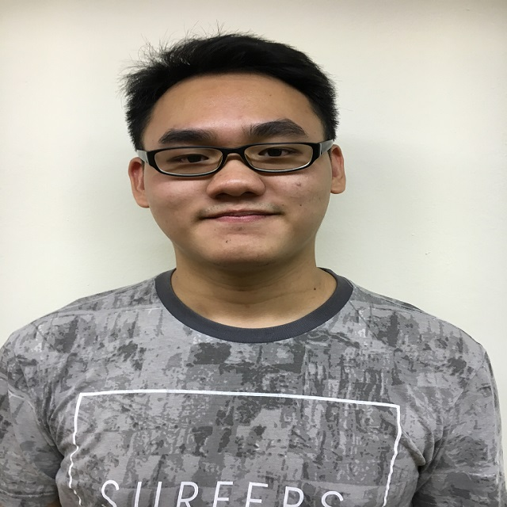

# About Us

We are a team based in the [School of Computing, National University of Singapore](http://www.comp.nus.edu.sg).

## Project Team

#### [Damith C. Rajapakse](http://www.comp.nus.edu.sg/~damithch)  
 
**Role**: Project Advisor

-----

#### [Yang Suwei](https://github.com/swxsw)
 
Role: Developer  
Responsibilities: Model

-----

#### [Jamos Tay](https://github.com/jamos-tay) 
 
Role: Developer  
* Components in charge of: [Logic](https://github.com/CS2103AUG2016-W09-C3/main/tree/master/src/main/java/seedu/address/logic)
* Aspects/tools in charge of: Testing, Git
* Features implemented:
   * [Undo/Redo command](https://github.com/CS2103AUG2016-W09-C3/main/blob/master/docs/UserGuide.md#undo-a-command--undo)
   * [Done/Undone command](https://github.com/CS2103AUG2016-W09-C3/main/blob/master/docs/UserGuide.md#mark-a-task-as-done--done)
   * [Filepath command](https://github.com/CS2103AUG2016-W09-C3/main/blob/master/docs/UserGuide.md#changing-filepath--filepath)
* Code written: [[functional code]()][[test code]()][[docs]()] // TODO
* Other major contributions:
  * Did refactoring from AddressBook to ToDoList with Su Wei and got tests to pass (only for the main folder) [[#7](https://github.com/CS2103AUG2016-W09-C3/main/pull/7)], [[#38](https://github.com/CS2103AUG2016-W09-C3/main/pull/38)]
  * Implemented Natty Date Parser [[#59](https://github.com/CS2103AUG2016-W09-C3/main/pull/59)]
  * Created custom command parser [[#13](https://github.com/CS2103AUG2016-W09-C3/main/pull/13)]
  * Did UI revamp [[#88](https://github.com/CS2103AUG2016-W09-C3/main/pull/88)]
  
-----

#### [Goh Qi Wei](https://github.com/qiwei24)
 
Role: Developer  
Responsibilities: Storage

-----

#### [Shaun Chee](https://github.com/ShaunChee) 
 
 Role: Developer  
 Responsibilities: UI

# Contributors

We welcome all feedbacks on ToDoIt. Please see [Contact Us](ContactUs.md) page for more info.