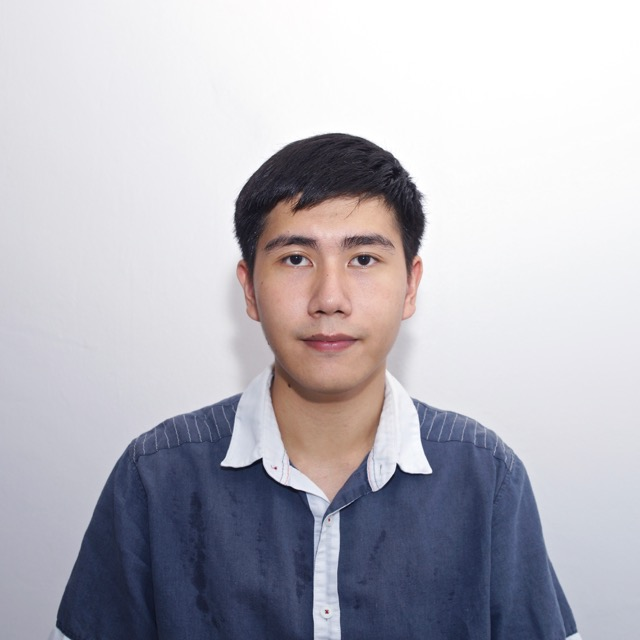
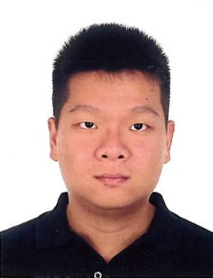

# About Us

We are a team based in the [School of Computing, National University of Singapore](http://www.comp.nus.edu.sg).

## Project Team

#### [Damith C. Rajapakse](http://www.comp.nus.edu.sg/~damithch)  
 
**Role**: Project Advisor

-----

#### [Yang Suwei](https://github.com/swxsw)
 
Role: Developer    
Responsibilities: Model

-----

#### [Jamos Tay](https://github.com/jamos-tay) 
 
Role: Developer    
Responsibilities: Logic

-----

#### [Goh Qi Wei](https://github.com/qiwei24)
 
Role: Developer    
Responsibilities: Storage

-----

#### [Shaun Chee](https://github.com/ShaunChee) 
 
 Role: Developer    
 Responsibilities: UI

# Contributors

We welcome contributions. See [Contact Us](ContactUs.md) page for more info.