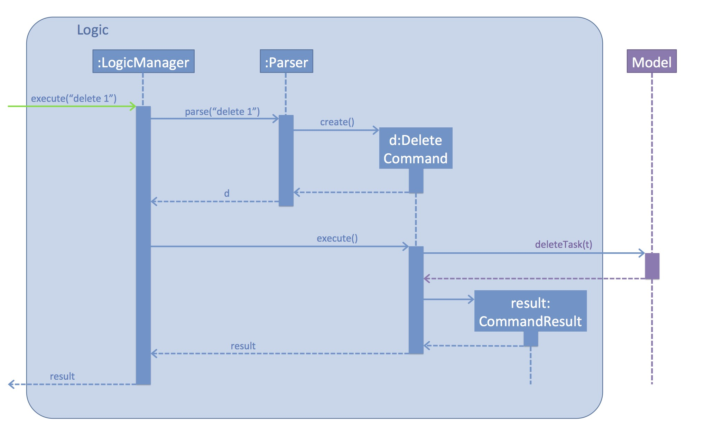
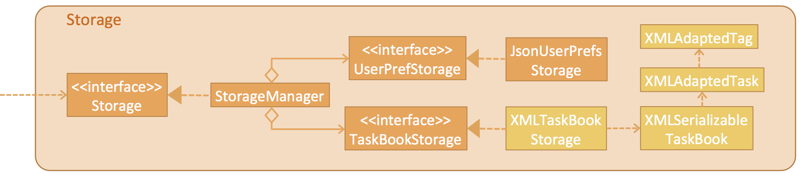
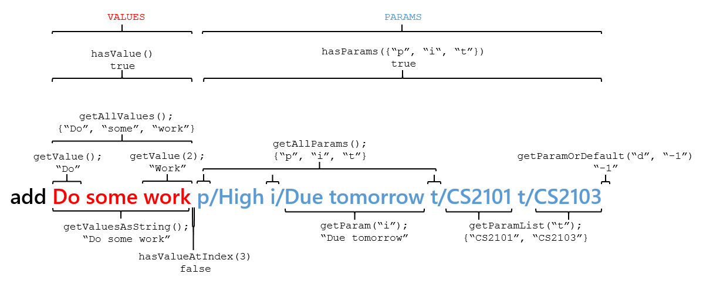
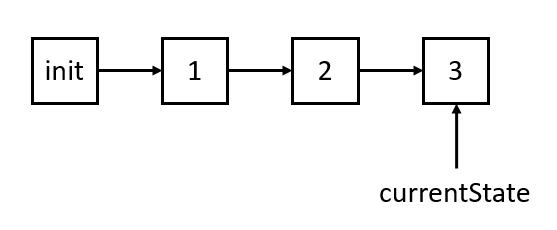
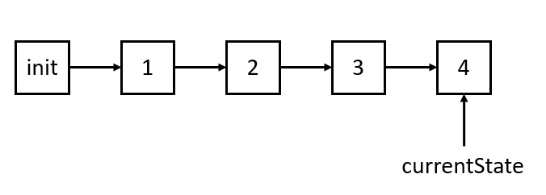
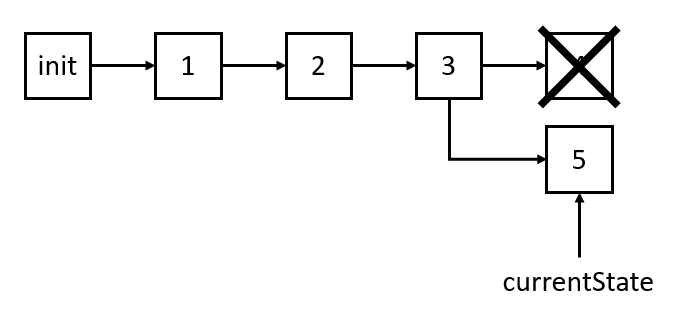

# Developer Guide 

* [Setting Up](#setting-up)
* [Design](#design)
* [Implementation](#implementation)
* [Testing](#testing)
* [Dev Ops](#dev-ops)
* [Appendix A: User Stories](#appendix-a--user-stories)
* [Appendix B: Use Cases](#appendix-b--use-cases)
* [Appendix C: Non Functional Requirements](#appendix-c--non-functional-requirements)
* [Appendix D: Glossary](#appendix-d--glossary)
* [Appendix E : Product Survey](#appendix-e--product-survey)

## Setting up

#### Prerequisites

1. **JDK `1.8.0_60`**  or later 

    > Having any Java 8 version is not enough.  
    This app will not work with earlier versions of Java 8.
    
2. **Eclipse** IDE
3. **e(fx)clipse** plugin for Eclipse (Do the steps 2 onwards given in
   [this page](http://www.eclipse.org/efxclipse/install.html#for-the-ambitious))
4. **Buildship Gradle Integration** plugin from the Eclipse Marketplace

#### Importing the project into Eclipse

0. Fork this repo, and clone the fork to your computer
1. Open Eclipse (Note: Ensure you have installed the **e(fx)clipse** and **buildship** plugins as given 
   in the prerequisites above)
2. Click `File` > `Import`
3. Click `Gradle` > `Gradle Project` > `Next` > `Next`
4. Click `Browse`, then locate the project's directory
5. Click `Finish`

  > * If you are asked whether to 'keep' or 'overwrite' config files, choose to 'keep'.
  > * Depending on your connection speed and server load, it can even take up to 30 minutes for the set up to finish
      (This is because Gradle downloads library files from servers during the project set up process)
  > * If Eclipse auto-changed any settings files during the import process, you can discard those changes.
  
#### Troubleshooting project setup

**Problem: Eclipse reports compile errors after new commits are pulled from Git**
* Reason: Eclipse fails to recognize new files that appeared due to the Git pull. 
* Solution: Refresh the project in Eclipse:  
  Right click on the project (in Eclipse package explorer), choose `Gradle` -> `Refresh Gradle Project`.
  
**Problem: Eclipse reports some required libraries missing**
* Reason: Required libraries may not have been downloaded during the project import. 
* Solution: [Run tests using Gardle](UsingGradle.md) once (to refresh the libraries).
 

## Design

### Architecture

 
The **_Architecture Diagram_** given above explains the high-level design of the App.
Given below is a quick overview of each component.

`Main` has only one class called [`MainApp`](../src/main/java/seedu/address/MainApp.java). It is responsible for,
* At app launch: Initializes the components in the correct sequence, and connect them up with each other.
* At shut down: Shuts down the components and invoke cleanup method where necessary.

[**`Commons`**](#common-classes) represents a collection of classes used by multiple other components.
Two of those classes play important roles at the architecture level.
* `EventsCentre` : This class (written using [Google's Event Bus library](https://github.com/google/guava/wiki/EventBusExplained))
  is used by components to communicate with other components using events (i.e. a form of _Event Driven_ design)
* `LogsCenter` : Used by many classes to write log messages to the App's log file.

The rest of the App consists four components.
* [**`UI`**](#ui-component) : The UI of tha App.
* [**`Logic`**](#logic-component) : The command executor.
* [**`Model`**](#model-component) : Holds the data of the App in-memory.
* [**`Storage`**](#storage-component) : Reads data from, and writes data to, the hard disk.

Each of the four components
* Defines its _API_ in an `interface` with the same name as the Component.
* Exposes its functionality using a `{Component Name}Manager` class.

For example, the `Logic` component (see the class diagram given below) defines it's API in the `Logic.java`
interface and exposes its functionality using the `LogicManager.java` class. 
 

The _Sequence Diagram_ below shows how the components interact for the scenario where the user issues the
command `delete 1`.

>Note how the `Model` simply raises a `TaskBookChangedEvent` when the Task Book data are changed,
 instead of asking the `Storage` to save the updates to the hard disk.

The diagram below shows how the `EventsCenter` reacts to that event, which eventually results in the updates
being saved to the hard disk and the status bar of the UI being updated to reflect the 'Last Updated' time.  

> Note how the event is propagated through the `EventsCenter` to the `Storage` and `UI` without `Model` having
  to be coupled to either of them. This is an example of how this Event Driven approach helps us reduce direct 
  coupling between components.

The sections below give more details of each component.

### UI component

 

**API** : [`Ui.java`](../src/main/java/seedu/address/ui/Ui.java)

The UI consists of a `MainWindow` that is made up of parts e.g.`CommandBox`, `ResultDisplay`, `PersonListPanel`,
`StatusBarFooter`, `BrowserPanel` etc. All these, including the `MainWindow`, inherit from the abstract `UiPart` class
and they can be loaded using the `UiPartLoader`.

The `UI` component uses JavaFx UI framework. The layout of these UI parts are defined in matching `.fxml` files
 that are in the `src/main/resources/view` folder. 
 For example, the layout of the [`MainWindow`](../src/main/java/seedu/address/ui/MainWindow.java) is specified in
 [`MainWindow.fxml`](../src/main/resources/view/MainWindow.fxml)

The `UI` component,
* Executes user commands using the `Logic` component.
* Binds itself to some data in the `Model` so that the UI can auto-update when data in the `Model` change.
* Responds to events raised from various parts of the App and updates the UI accordingly.

### Logic component

 

**API** : [`Logic.java`](../src/main/java/seedu/address/logic/Logic.java)

1. `Logic` uses the `Parser` class to parse the user command.
2. This results in a `Command` object which is executed by the `LogicManager`.
3. The command execution can affect the `Model` (e.g. adding a task) and/or raise events.
4. The result of the command execution is encapsulated as a `CommandResult` object which is passed back to the `Ui`.

Given below is the Sequence Diagram for interactions within the `Logic` component for the `execute("delete 1")`
 API call. 
 

<!-- @@author A0139121R -->
### Model component

 

**API** : [`Model.java`](../src/main/java/seedu/address/model/Model.java)

The `Model`,
* stores a `UserPref` object that represents the user's preferences.
* stores the Task Book data.
* exposes a `UnmodifiableObservableList<ReadOnlyPerson>` that can be 'observed' e.g. the UI can be bound to this list
  so that the UI automatically updates when the data in the list change.
* does not depend on any of the other three components.
<!-- @@author -->

### Storage component

 

**API** : [`Storage.java`](../src/main/java/seedu/address/storage/Storage.java)

The `Storage` component,
* can save `UserPref` objects in json format and read it back.
* can save the Task Book data in xml format and read it back.

### Common classes

Classes used by multiple components are in the `seedu.TaskBook.commons` package.

## Implementation

### Logging

We are using `java.util.logging` package for logging. The `LogsCenter` class is used to manage the logging levels
and logging destinations.

* The logging level can be controlled using the `logLevel` setting in the configuration file
  (See [Configuration](#configuration))
* The `Logger` for a class can be obtained using `LogsCenter.getLogger(Class)` which will log messages according to
  the specified logging level
* Currently log messages are output through: `Console` and to a `.log` file.

**Logging Levels**

* `SEVERE` : Critical problem detected which may possibly cause the termination of the application
* `WARNING` : Can continue, but with caution
* `INFO` : Information showing the noteworthy actions by the App
* `FINE` : Details that is not usually noteworthy but may be useful in debugging
  e.g. print the actual list instead of just its size

### Configuration

Certain properties of the application can be controlled (e.g App name, logging level) through the configuration file 
(default: `config.json`):

## Testing

Tests can be found in the `./src/test/java` folder.

**In Eclipse**:
* To run all tests, right-click on the `src/test/java` folder and choose
  `Run as` > `JUnit Test`
* To run a subset of tests, you can right-click on a test package, test class, or a test and choose
  to run as a JUnit test.

**Using Gradle**:
* See [UsingGradle.md](UsingGradle.md) for how to run tests using Gradle.

We have two types of tests:

1. **GUI Tests** - These are _System Tests_ that test the entire App by simulating user actions on the GUI. 
   These are in the `guitests` package.
  
2. **Non-GUI Tests** - These are tests not involving the GUI. They include,
   1. _Unit tests_ targeting the lowest level methods/classes.  
      e.g. `seedu.address.commons.UrlUtilTest`
   2. _Integration tests_ that are checking the integration of multiple code units 
     (those code units are assumed to be working). 
      e.g. `seedu.address.storage.StorageManagerTest`
   3. Hybrids of unit and integration tests. These test are checking multiple code units as well as 
      how the are connected together. 
      e.g. `seedu.address.logic.LogicManagerTest`
  
**Headless GUI Testing** :
Thanks to the [TestFX](https://github.com/TestFX/TestFX) library we use,
 our GUI tests can be run in the _headless_ mode. 
 In the headless mode, GUI tests do not show up on the screen.
 That means the developer can do other things on the Computer while the tests are running. 
 See [UsingGradle.md](UsingGradle.md#running-tests) to learn how to run tests in headless mode.
 
#### Troubleshooting tests
 **Problem: Tests fail because NullPointException when AssertionError is expected**
 * Reason: Assertions are not enabled for JUnit tests. 
   This can happen if you are not using a recent Eclipse version (i.e. _Neon_ or later)
 * Solution: Enable assertions in JUnit tests as described 
   [here](http://stackoverflow.com/questions/2522897/eclipse-junit-ea-vm-option).  
   Delete run configurations created when you ran tests earlier.
  
## Dev Ops

### Build Automation

See [UsingGradle.md](UsingGradle.md) to learn how to use Gradle for build automation.

### Continuous Integration

We use [Travis CI](https://travis-ci.org/) to perform _Continuous Integration_ on our projects.
See [UsingTravis.md](UsingTravis.md) for more details.

### Making a Release

Here are the steps to create a new release.
 
 1. Generate a JAR file [using Gradle](UsingGradle.md#creating-the-jar-file).
 2. Tag the repo with the version number. e.g. `v0.1`
 2. [Create a new release using GitHub](https://help.github.com/articles/creating-releases/) 
    and upload the JAR file your created.
   
### Managing Dependencies

A project often depends on third-party libraries. For example, Task Book depends on the
[Jackson library](http://wiki.fasterxml.com/JacksonHome) for XML parsing. Managing these _dependencies_
can be automated using Gradle. For example, Gradle can download the dependencies automatically, which
is better than these alternatives. 
a. Include those libraries in the repo (this bloats the repo size) 
b. Require developers to download those libraries manually (this creates extra work for developers) 

<!-- @@author A0140155U -->
## Model

In this section, the usage and design of certain features of model will be discussed.

### The Command Parser

 

The command parser is a custom utility used for parsing command syntax easily. It can be used to easily 
customize command behaviour for any new commands to be added.

Each command in ToDoIt consists of a command word, followed by a number of values (represented by any string),
followed by a number of params (represented by two strings separated by a slash i.e. `paramName/param value`).

The CommandParser class parses a command string (Note: **without** the command word) and returns a ParsedCommand
object with the following methods:

#### Value related:
* `getValue()`: Gets the first value in the list of values
* `getValueAtIndex(int index)`: Gets the value in the list of values corresponding to the index
* `getAllValues()`: Gets all values as an arraylist of strings
* `getValuesAsString()`: Gets all values as a string (space concatented)
* `hasValue()`: Returns true if the parsed command has at least one value
* `hasValueAtIndex(int index)`: Returns true if the parsed command has a value at the specified index

#### Param related:
* `getParam(String paramName)`: Retrieves the first param (Note: A param can appear multiple times) from the list corresponding to the param name
* `getParamOrDefault(String paramName, String defaultParam)`: Tries to retrieve the first param from the list corresponding to the param name. Returns defaultParam if the param does not exist
* `getAllParams()`: Gets all param names as an arraylist of strings
* `getParamList(String paramName)`: Retrieves all params from the list corresponding to the param name as an arraylist. Returns an empty list if there are no params corrsponding to the param name
* `hasParams(String[] params)`: Returns true if the parsed command contains every param in the array
* `hasUnnecessaryParams(String[] params)`: Takes in an array of regex strings and returns true if every param in the command matches a regex in the provided array. Used mainly to check if the user has provided any unnecessary parameters.

### Undo/Redo command

ToDoIt allows the user to undo and redo commands with `undo` and `redo`.

#### TaskBookState

This is accomplished by storing different states of the taskbook, using `TaskBookState`. `TaskBookState` is a class that is used solely to wrap two variables:

* `state`: A `TaskBook` object that stores the state of the to do list.
* `command`: A string that stores the command that is used to get to this state. This is solely used for displaying purposes.

#### StatesManager

States are stored and managed using the StatesManager class, which offers the following API:

* `saveState(TaskBookState newState)`: Saves the provided `TaskBookState`
* `loadPreviousState()`: Loads and returns the previous `TaskBookState`. Throws an error if there isn't one
* `loadNextState()`: Loads and returns the next `TaskBookState`. Throws an error if there isn't one

The `ModelManager` has a `StatesManager` object, which handles the state of the to do list as it changes. It calls either `loadPreviousState()` or `loadNextState()` and refreshes the to do list with the state's data.

#### State handling

The StateManager has two variables to keep track of states:

* `states`: An arraylist of `TaskBook` state which stores the state.
* `currentState`: An integer to keep track of the current state (the one displayed to the user). It stores the index of the current state in `states`.

The `states` array and the `currentState` always function such that `states[currentState - 1]`, `states[currentState]`, `states[currentState + 1]` always store the previous, current and next state respectively, assuming the states exist.

When the program is started, the ModelManager saves the init state using `saveState` into the array list and the `currentState` is set to 0.

#### Adding a state

When commands are run, a new `TaskBookState` is created and saved onto the stack using `saveState`. The `TaskBookState` stores the new state of the `TaskBook` object, and the command string that was used.

The `currentState` is incremented, so it now points to the new `TaskBookState`.

This is how the `StateManager` might look like after 3 commands, and the contents of the `states` list:

> `add Meeting`  
> `done 5`  
> `edit 1 i/Due today`

 

Index|TaskBookState|Command
-----|----------------|-------
0|[TaskBook 0]|`Initial State`
1|[TaskBook 1]|`add Meeting`
2|[TaskBook 2]|`done 5`
**3**|**[TaskBook 3]**|**`edit 1 i/Due today`**

If a 4th command is run, this is what it would look like:

> `clear`

 

Index|TaskBookState|Command
-----|----------------|-------
0|[TaskBook 0]|`Initial State`
1|[TaskBook 1]|`add Meeting`
2|[TaskBook 2]|`done 5`
3|[TaskBook 3]|`edit 1 i/Due today`
**4**|**[TaskBook 4]**|**`clear`**

#### Undoing

When the `undo` command is called, the state before the `currentState` is loaded.

The `ModelManager` calls `loadPreviousState()`, and the StatesManager handles this by decrementing the `currentState`, and returning the state corresponding to the `currentState`.

> `undo`

 

Index|TaskBookState|Command
-----|----------------|-------
0|[TaskBook 0]|`Initial State`
1|[TaskBook 1]|`add Meeting`
2|[TaskBook 2]|`done 5`
**3**|**[TaskBook 3]**|**`edit 1 i/Due today`**
4|[TaskBook 4]|`clear`

`return TaskBookState([TaskBook 3], "clear")`

Note that only the `currentState` is updated.

#### Redoing

The `redo` command is similar to `undo`, except `loadNextState()` is called instead. The StatesManager increments the `currentState`, and returns the state corresponding to the `currentState`.

> `redo`

 

Index|TaskBookState|Command
-----|----------------|-------
0|[TaskBook 0]|`Initial State`
1|[TaskBook 1]|`add Meeting`
2|[TaskBook 2]|`done 5`
3|[TaskBook 3]|`edit 1 i/Due today`
**4**|**[TaskBook 4]**|**`clear`**

`return TaskBookState([TaskBook 4], "clear")`

It's important to note that `loadPreviousState()` returns the previous state's (3) state, but the current state's (4) command, while `loadNextState()` returns the current state's (4) command and data. This is needed for displaying the command result message.

#### Overwriting

When a new command is run, and a state is saved, but the `currentState` points to a state in the middle of the list, all future states have to be overwritten. 

 

Index|TaskBookState|Command
-----|----------------|-------
0|[TaskBook 0]|`Initial State`
1|[TaskBook 1]|`add Meeting`
2|[TaskBook 2]|`done 5`
**3**|**[TaskBook 3]**|**`edit 1 i/Due today`**
4|[TaskBook 4]|`clear`

> `done 7`

 

Index|TaskBookState|Command
-----|----------------|-------
0|[TaskBook 0]|`Initial State`
1|[TaskBook 1]|`add Meeting`
2|[TaskBook 2]|`done 5`
3|[TaskBook 3]|`edit 1 i/Due today`
**4**|**[TaskBook 5]**|**`done 7`**

#### Other concerns

Since a copy of the to do list is saved to a state after each command, the amount of memory stored can be quite big. As such, a hard cap of 10 states (`MAX_STATES`) is imposed.

A better solution might be to have custom undos for each command storing only the minimal amount of data needed to undo it, or to use a shallow copied list + copy-on-write system, but due to limited time constraints, we have decided to go with our current solution.

<!-- @@author -->
<!-- @@author A0139947L -->

## Appendix A : User Stories

Priorities: High (must have) - `* * *`, Medium (nice to have)  - `* *`,  Low (unlikely to have) - `*`

Priority | As a ... | I want to ... | So that I can...
-------- | :-------- | :--------- | :-----------
`* * *` | user | schedule task into the calendar | 
`* * *` | user | mark a task as done after i do the task | 
`* * *` | user | remove a task from my list of tasks | 
`* * *` | user | view all available commands | know how to use the commands
`* * *` | user | reschedule a task | make changes if there are changes in my schedule
`* * *` | user | add a task without setting deadlines | 
`* *` | user | set recurring tasks that occur repeatedly after a set interval | easily manage my weekly/monthly tasks
`* *` | user | have the ability to share my tasks with my friends | 
`* *` | user | print my to-do schedule | 
`* *` | user | list all tasks that needs to be done in a specific timeframe | 
`* *` | user | set reminders or notifications for important events | remind myself of my schedule
`* *` | user | import an existing task list from another file | conveniently move my task list from one computer to another
`* *` | user | sort my tasks in order based on date or priority | see what needs to be done based on priority
`*` | user | input my tasks in different languages | 
`*` | user | customise the command words for the program | use the program in the way I want to use it
<!-- @@author -->

<!-- @@author A0139046E -->

## Appendix B : Use Cases

(For all use cases below, the **System** is the `ToDoIt` and the **Actor** is the `user`, unless specified otherwise)

<!-- @@author A0139121R -->
#### Use case: Add task

**MSS**

1. User requests to add task
2. ToDoIt add the task
3. ToDoIt shows a list of task including the added task  
Use case ends.

**Extensions**

2a. The added task is the same

> 2a1. ToDoIt shows an error message  
  Use case ends
<!-- @@author -->
<!-- @@author A0139046E -->

#### Use case: Delete task

**MSS**

1. User requests to list tasks
2. ToDoIt shows a list of tasks
3. User requests to delete a specific task in the list
4. ToDoIt deletes the task  
Use case ends.

**Extensions**

2a. The list is empty

> Use case ends

3a. The given index is invalid

> 3a1. ToDoIt shows an error message  
  Use case resumes at step 2
  
#### Use case: Edit task

**MSS**

1. User requests to edit task
2. ToDoIt shows a list of tasks
3. User requests to edit a specific task in the list
4. ToDoIt edits the task  
Use case ends.

**Extensions**

2a. The list is empty

> Use case ends

3a. The given index is invalid

> 3a1. ToDoIt shows an error message  
  Use case resumes at step 2

#### Use case: Reschedule task

**MSS**

1. User requests to list tasks
2. ToDoIt shows a list of tasks
3. User requests to reschedule a specific task in the list to another specified list
4. ToDoIt reschedules the task  
Use case ends.

**Extensions**
2a. The list is empty

>Use case ends

3a. The given index is invalid

>3a1. ToDoIt shows an error message  
 Use case ends

<!-- @@author A0139121R -->

#### Use case: Find task

**MSS**

1. User requests to find task by keywords and attribute
2. ToDoIt shows a list of tasks  with specified keywords in specified attribute fields  
Use case ends.

**Extensions**
2a. The list is empty

>Use case ends

3a. There is no matching tasks

>Use case ends

<!-- @@author A0139046E -->
#### Use case: Done

**MSS**

1. User requests to list tasks
2. ToDoIt shows a list of tasks
3. User request to set task as done
4. ToDoIt sets the specified task as done  
Use case ends.

**Extensions**
2a. The list is empty

>Use case ends

3a. The given index is invalid

>3a1. ToDoIt shows an error message  
 Use case ends

#### Use case: Undone

**MSS**

1. User requests to list tasks
2. ToDoIt shows a list of tasks
3. User request to set task as undone
4. ToDoIt sets the specified task as undone  
Use case ends.

**Extensions**
2a. The list is empty

>Use case ends

3a. The given index is invalid

>3a1. ToDoIt shows an error message  
 Use case ends

<!-- @@author A0139121R -->
#### Use case: List tasks

**MSS**

1. User requests to list tasks in specified order with specified time frame
2. ToDoIt shows a list of tasks in time frame in the specified order  
Use case ends.

**Extensions**

2a. The list is empty

>Use case ends

3a. The given time frame or specified order is invalid

>3a1. ToDoIt shows an error message  
 Use case ends
 
<!-- @@author -->

<!-- @@author A0139046E -->

#### Use case: Favorite

**MSS**

1. User requests to favorite a command
2. ToDoIt adds the favorited command into the presets panel  
Use case ends.

**Extensions**

1a. Invalid command to favorite

> 1a1. ToDoIt shows an error message  
  Use case ends
 
#### Use case: Unfavorite

**MSS**

1. User requests to unfavorite a command
2. ToDoIt removes the unfavorited command from the presets panel  
Use case ends.

**Extensions**

1a. The given index is invalid

> 1a1. ToDoIt shows an error message  
  Use case ends.

#### Use case: Undo/Redo

**MSS**

1. User requests to undo/redo to the previous state
2. ToDoIt moves current state to the previous state  
Use case ends.

**Extensions**

1a. The user uses `undo` more than 10 times consecutively

> 1a1. ToDoIt shows an error message that he has reached the maximum undo limit  
  Use case ends.

#### Use case: Filepath

**MSS**

1. User requests to change the filepath
2. ToDoIt copies his current task data in the current file to the desired file path
Use case ends.

**Extensions**

1a. Filepath is not a valid .xml file

> 1a1. ToDoIt shows an error message  
  Use case ends
  
<!-- @@author -->

<!-- @@author A0139947L -->

## Appendix C : Non Functional Requirements

1. Should be able to hold up to 1000 tasks
2. Should contain a user guide on how to use the product
3. Should have a back-up memory
4. Should be able to work without internet connection
5. Should come with automated unit tests
6. Should favor DOS style commands over Unix-style commands

## Appendix D : Glossary

##### Mainstream OS

> Windows, Linux, Unix, OS-X

## Appendix E : Product Survey

Document product survey:

Product | Pros | Cons | Summary
-------- | :----------- | :----------- | :-----------
Google Calendar | 1. Integration with all of google's existing products including google now voice assistant  2. Shortcuts available from within gmail  3. Available on all platforms  4. Can sync calendar with other people  5. Notifications and reminders about tasks  6. Automatic addition of events from gmail   | 1. Needs to be accessed with browsers mainly or phone applications  2. Needs internet connection to keep updated  3. Not much support for tasks without a clear deadline or timing   | Google Calendar fits the requirements as if the user uses gmail, it would be a lot easier using the automatic addition feature in gmail. However, a web-based solution may not be the fastest to work with due to the lack of support for tasks.
Todo.txt | 1. Simple and fast  2. Able to set different priorities for task  3. Able to group task into a particular project so that we can see all tasks related to the project  4. Todo.txt supports dropbox, so the user can sync easily sync task between mobile on both Android and Apple phones with the computers | 1. No support for recurring task  2. Only for users that prefer command line input | Todo.txt will cater to users like Jim to a large extend. Todo.txt is perfect for Jim as it uses command line inputs, and ToDo.txt meets a lot of our requirements for our program so we can use this application as a gauge.
Wunderlist | 1. Aesthetically pleasing with a responsive interface  2. Self-explanatory UI  3. Able to add/delete in one click  4. Able to sync with other devices  5. Able to categorise tasks into different categories  6. Able to "star" tasks to priotise them  7. Able to view completed tasks and mark them as undone | 1. Date detection is dodgy (Detects only specific combinations of dates)  2. Task description and date has to be entered separately  3. No built in calendar | Wunderlist is an easy to use application, serving more as a to-do list than a calendar. It is geared towards users who wants a simple reminder of things they have to do rather than a full task scheduler application.
Fantastical | 1. Simple interface with little to no distractions  2. Built in search and alarm functions for various tasks  3. Able to sync with other online calendars  4. Able to carry out most features without opening the actual calendar application | 1. Fantastical is only free for the first 21-days  2. Fantastical is an iPhone/MacBook friendly application (Only suits to Apple products) | Overall, Fantastical is a great calendar management application. Fantastical caters to Jim's needs and more, such as having alarm and search functions. Since this is a paid application, it is also well maintained with little to no distractions (no advertisements).
<!-- @@author -->
