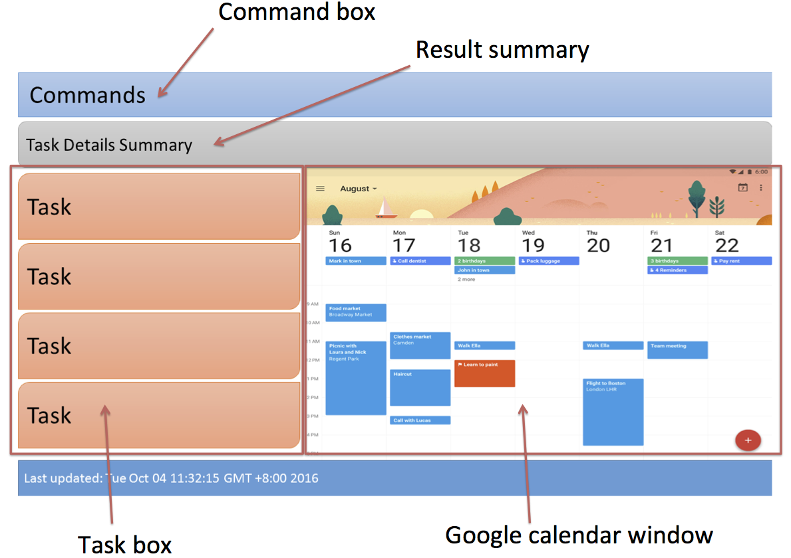

# User Guide

* [About](#about)
* [Quick Start](#quick-start)
* [Features](#features)
* [FAQ](#faq)
* [Command Summary](#command-summary)

## About

   Always forgetting what to do? Have difficulties managing your hectic timetable? If you want to plan your day efficiently, then we have got just the app just for you, ToDoIt! 
    
   ToDoIt is a task manager that keeps your daily activities in check. 
   It will notify you of the upcoming activities for the day or the week. 
    
   ToDoIt has a simple command-line based interface which caters to people who are more comfortable with typing instead of navigating complex user interfaces. However that is not to say ToDoIt is not for beginners, the interface is simple and commands are intuitive; beginners can start using it immediately. 
    
   ToDoIt has a simple command-line based interface which caters to people who are more comfortable with typing instead of navigating complex user interfaces. However that is not to say ToDoIt is not for beginners, the interface is simple and commands are intuitive; beginners can start using it immediately. 
    
   This user guide aims to describe how you, as a user, can use ToDoIt to accomplish various tasks. 
    
   Are you ready? Let's get started! 

## Quick Start

0. Ensure you have Java version `1.8.0_60` or later installed in your Computer. 
   > Having any Java 8 version is not enough.  
   This app will not work with earlier versions of Java 8.
   
1. Download the latest `ToDoIt.jar` from the [releases](../../../releases) tab.
2. Copy the file to the folder you want to use as the home folder for your ToDoIt task file.
3. Double-click the ToDoIt.jar to start the app. The GUI should appear in a few seconds. 
4. Type the command in the command box and press <kbd>Enter</kbd> to execute it.  
   e.g. typing **`help`** and pressing <kbd>Enter</kbd> will open the help window. 
6. Some example commands you can try:
   * **`list`** : lists all tasks
   * **`add`**` Meeting with John d/tomorrow l/2h p/medium i/Meeting with John regarding sales` : 
     adds a task named `Meeting with John` to the task list.
   * **`delete`**` 3` : deletes the 3rd task shown in the current list
   * **`exit`** : exits the app
7. Refer to the [Features](#features) section below for details of each command. 

## Features

 

Ensure you've followed the quick start guide to downloading this program. Simply double click the app to run it. As you can see, the prototype User Interface will be shown above.

When the program is started, you will see 4 controls:

1. The command box. This is where commands are entered. Simply type the command you want to execute, and press enter to execute it.
2. The result summary. Once a command is entered, relevant information will be logged in this box. You can view it to ensure the command has been executed correctly.
3. The task box. This displays the tasks you have entered. Tasks retrieved from the `list` or `find` command will also be reflected here.
4. The Google Calendar Window. Tasks entered will be automatically synced to your google calendar. Disclaimer: This is still a work in progress, and may not be in the final release.

###Command Format
* Each command consists of a command word (such as find, or help), followed by additional options. An option is a word or character followed by a forward slash (e.g. a/, ds/ etc.).
* An option may require additional data, specified after the forward slash (e.g. desc/Go to Work). `UPPER_CASE` words in the format describe the data to input.
* Options in `SQUARE_BRACKETS`"[]" are optional.
* Options with `...` after them can be specified multiple times (e.g. `t/Work t/School t/CS2103`).
* The order of options to specify for each command is fixed.

<!-- @@author A0140155U -->

### Date Specifications

ToDoIt accepts most common formats of dates. Some examples include:

* 2015-12-31
* 2015/12/31
* 12/31/2015
* 31st Dec 2015
* 31st of December
* Dec 31st
* Next Thursday 2pm
* Last Wednesday 0500h
* Tomorrow 5:30am
* 3 days from now

For a full list of accepted formats, please refer to:
http://natty.joestelmach.com/doc.jsp

<!-- @@author -->
---

### Viewing help : `help`
Format: `help`

The help command provides you with a detailed explanation of the available commands within the program.

**Notes**
> * Help is also shown if you enter an incorrect command e.g. `abcd`

---

### Adding a task: `add`
Format: `add TASK_NAME [d/DATE_TIME de/END_DATE_TIME l/LENGTH] [r/RECUR] [p/PRIORITY] [a/] [i/INFORMATION] [t/TAG]...`

ToDoIt compiles your tasks for the day efficiently with a simple line of text. The `add` command adds your tasks to the to do list, allowing you to view them any time you want.

**Options**
> 1. `d/` Date and time: Specifies the start date and time of a task. Please refer to the Date Specifications section for accepted formats.
> 2. `de/` End date and time: Specifies the end date and time of the task. Please refer to the Date Specifications section for the accepted formats. This parameter should not be used in conjunction with `l/`.
<!-- @@author A0139947L -->
> 3. `l/` Length: Specifies the length of time. Defaults to 1 hour if time and date are specified, but length is not specified. Use a number followed by a time interval (`m`, `h`, `d`, `w`, for minutes, hours, days, weeks respectively), e.g. `6d`, `1w`. You may also use `hr`, `hrs`, `day`, `days`, `week` and `weeks` for their respective interval. This parameter should not be used together with `de/`.
> 4. `r/` Recur: Specifies an interval for recurring task, if any. Use a number followed by a time interval (`m`, `h`, `d`, `w`, for minutes, hours, days, weeks respectively), e.g. `6d`, `1w`. You may also use `hr`, `hrs`, `day`, `days`, `week` and `weeks` for their respective interval. 
> 5. `p/` Priority: Specifies the priority of a task (`veryhigh`, `high`, `medium` `low`, `verylow`). You may also use `vh`, `h`, `m`, `l` or `vl` for their respective priorities.
<!-- @@author -->
> 6. `a/` Autoschedule: If flag is specified, the task will be automatically scheduled to a free slot. If a time, date and length is specified, this flag is ignored.
> 7. `i/` Information: Information to be tagged to this task. Put any extra details you want here.
> 8. `t/` Tags: Specifies tags that are tagged to this task. Tags allow you to group tasks logically by assigning them a similar tag.

**Notes**
> * A task can be dated (has time, date, length), or floating. A floating task is one without any specified date, time and length which can be done at a flexible timing.  
> * If a task is dated (d/ option specified) but length is not specified, the duration defaults to 1 hour.  
> * Tasks can have any number of tags (including 0). Simply repeat the t/ option (e.g. `t/work t/school t/CS2103`).

**Example**
> * You have a CS2101 Lecture weekly, starting from 7th Oct at 2pm. However, the lecture is webcasted so you don't always have to attend, thus making it low priority. You simply have to run:  
>   `add CS2101 Lecture h/7th Oct 2pm l/2hr r/1w p/low t/got-webcast`  
>   This will add a CS2101 Lecture task which recurs every week starting with 2pm on 7th Oct, marks it as low priority and tags it with the `got-webcast` tag.

---

### Listing tasks : `list`
ToDoIt displays your tasks easily with a simple command. The tasks to list can be customized to your liking simply with a few keywords. 
Format: `list [ds/DATE_START] [ds/DATE_END] [s/SORT_BY] [df/DONE_STATUS] [rev/]`

**Options**
> 1. `ds/` Date start: If a start date is specified, program will only display tasks after this date. If the option is used without a specified date, it will use today's date.
> 2. `de/` Date end: If an end date is specified, program will only display tasks before this date. If the option is used without a specified date, , it will use today's date.
> 3. `s/` Sort by: Sorts the tasks in the order specified (`date`, `time`, `alphabetical`, `priority`).
> 4. `df/` Done tasks: If this flag is specified, tasks that are marked done will be shown. The available done flags are "done", "not done" and "all".
> 5. `rev/` Reverse: If this flag is specified, tasks will be listed in reverse order after sorting.

**Notes**
> * For start and end dates, please refer to Date Specifications section for what formats are accepted.
> * Tasks marked done will be hidden by default. To view done tasks, include the df/all or df/done option.

**Example**
> * You want to view all upcoming tasks ordered by date, so you know what needs to be done.  
>   `list ds/ s/date`
> * You want to see all the tasks you have completed in the past year, to celebrate what you've done with your life.  
>   `list ds/1st Jan 2016 de/ df/done`

---

### Finding all tasks containing a keyword: `find`
ToDoIt searches and finds the tasks you need, while filtering out the clutter. Keep your mind focused on what is important. 
Format: `find KEYWORD [MORE_KEYWORDS] [s/SCOPE]...`

**Options**
> 1. `s/` Scope: If you only want to search a task's specific attribute, specify which attributes you want to search here (`name` : name, `tag` : tag, `information` : information). By default, it searches in all three areas.

**Notes**
> * The search is not case sensitive. e.g `stuff` will match `Stuff`  
> * The order of the keywords does not matter. e.g. `Do stuff` will match `Stuff do`  
> * Only full words will be matched e.g. `Work` will not match `Workout`  
> * Tasks matching at least one keyword will be returned (i.e. `OR` search). 
    e.g. `Stuff` will match `Do stuff` 
> * You can specify more than one search scope (`s/name s/information`). All areas specified will be searched.
> * If no search scope parameter is provided, all attributes (name, information, tag) are searched by default

**Example**
> * You remember naming a task `meeting`, and you want to look for it. However, you don't want to bring up unnecessary tasks so you search for task names only.  
>   `find meeting s/name` 
> * You want to find all tasks that relate to your family.  
>   `find brother sister mother father family`

---
  
### Deleting a task : `delete`
Some say that cancelled plans are the introvert's source of joy. Simply remove tasks you do not need with a simple command. 
Format: `delete INDEX`

**Notes**
> * This deletes the task at the specified `INDEX`.  
    The index refers to the index number shown in the most recent listing. 
    The index **must be a positive integer** `1`, `2`, `3`, ...
> * Use find or list command to display tasks and use the order numbering as Index.

**Example**
> * Having displayed all tasks, you want to remove the one in the second position. 
>   `list` 
    `delete 2` 
> * After retrieving all work related tasks, you want to delete the first one. 
>   `find work`  
    `delete 1` 
    Deletes the 1st task in the results of the `find` command.

---

### Clear all tasks : `clear`
Sometimes you just have to start fresh. Remove everything in your task list with one command. 
Format: `clear`

---

### Editing a task: `edit`
You never know when things change. Life is unpredictable. ToDoIt knows this, and allows you to adapt to the erratic changes you may have in your schedule. Modify your tasks with a simple command. 
Format: `edit INDEX [n/TASK_NAME] [d/DATE_TIME] [l/LENGTH] [r/RECUR] [p/PRIORITY] [i/INFORMATION] [t/TAG]...` 

**Options**
> 1. `n/` Name: The new name of the task.
> 1. `d/` Date and time: Specifies the start date and time of a task. Please refer to the Date Specifications section for what formats are accepted.
<!-- @@author A0139947L -->
> 2. `l/` Length: Specifies the length of time. Defaults to 1 hour if time and date are specified, but length is not specified. Use a number followed by a time interval (`m`, `h`, `d`, `w`, for minutes, hours, days, weeks respectively), e.g. `6d`, `1w`. You may also use `hr`, `hrs`, `day`, `days`, `week` and `weeks` for their respective interval.
> 3. `r/` Recur: Specifies an interval for recurring task, if any. Use a number followed by a time interval (`m`, `h`, `d`, `w`, for minutes, hours, days, weeks respectively), e.g. `6d`, `1w`. You may also use `hr`, `hrs`, `day`, `days`, `week` and `weeks` for their respective interval.
> 4. `p/` Priority: Specifies the priority of a task (`veryhigh`, `high`, `medium` `low`, `verylow`). You may also use `vh`, `h`, `m`, `l` or `vl` for their respective priorities.
<!-- @@author -->
> 5. `a/` Autoschedule: If flag is specified, the task will be automatically scheduled to a free slot. If a time, date and length is specified, this flag is ignored.
> 6. `i/` Information: Information to be tagged to this task. Put any extra details you want here.
> 7. `t/` Tags: Specifies tags that are tagged to this task. Tags allow you to group tasks logically by assigning them a similar tag.

**Notes**
> * This edits the task at the specified `INDEX`.  
    The index refers to the index number shown in the most recent listing. 
    The index **must be a positive integer** `1`, `2`, `3`, ...  
> * Replaces the current task data with the specified task data. 
> * When editing a task's date and time, if only the date or the time is specified, then only the date or the time will be edited. For example, including `d/6th Oct` a task on 5th Oct 2pm will change the date to 6th Oct 2pm. 
> * For more information regarding the options, refer to `add` command.

**Example**
> * Your boss just changed the date of a meeting on the 3rd October to the 2nd. Simply find your meeting task, then run the following command:  
>   `find meeting`  
    `edit 1 d/2nd Oct`

---
  
### Rescheduling a task: `reschedule`
ToDoIt does not expect you to be the perfect worker. Sometimes you are too busy or tired to do a task. If you are not feeling up to it right now, simply reschedule it for another day. 
Format: `reschedule INDEX INTERVAL` 

**Notes**
> * This reschedules the task at the specified `INDEX`.   
    The index refers to the index number shown in the most recent listing. 
    The index **must be a positive integer** `1`, `2`, `3`, ...  
> * For interval, use a number followed by a time interval (`m`, `h`, `d`, `w`, for minutes, hours, days, weeks respectively), e.g. `6d`, `1w`
> * Negative numbers are not supported. To reschedule to an earlier time, consider using `edit` instead.
 
**Example**
> * You need to get some homework done, but you just got back from school and you need a break. Simply find your homework task, then run the following command:  
>   `find homework`  
    `reschedule 1 1h`

---
  
### Mark a task as done : `done`
Hooray! You've just completed a task! Celebrate your accomplishment by marking it as done. 
Format: `done INDEX`

**Notes**
> * This marks task at the specified `INDEX` as done.  
    The index refers to the index number shown in the most recent listing. 
    The index **must be a positive integer** `1`, `2`, `3`, ... 
> * Marking a task as done will stop it from showing up in any `list` command, unless the `\df` option is used.
 
**Example**
> * You just completed your homework. Simply find your homework task, then run the following command:  
>   `find homework`  
    `done 1`

---
  
### Mark a task as done : `undone`
Thought you were done, but actually there was one little thing that you forgot to do? No worries, we have all been there. Use this simple command to mark done tasks as not done. Do not worry, ToDoIt will not mock you. 
Format: `undone INDEX`

**Notes**
> * This marks task at the specified `INDEX` as undone.  
    The index refers to the index number shown in the most recent listing. 
    The index **must be a positive integer** `1`, `2`, `3`, ... 
 
**Example**
> * You accidentally miscounted and marked the wrong task as done. Simply revert it with the following command:  
>   `done 3 (mistake)`  
    `undone 3`

---
  
### Undo a command : `undo`
Made a mistake? No worries, ToDoIt is forgiving. Undo your previous commands with this simple command. 
Format: `undo`

**Notes**
> * The program can only undo up to the 10 previous commands.

---
  
### Redo a command : `redo`
Made a mistake while undoing your mistake? Redo your `undo` commands with this simple command. 
Format: `redo`

---

### Exiting the program : `exit`
ToDoIt is sad to see you go. 
Format: `exit`  

---
<!-- @@author A0139121R -->
## FAQ

**Q**: How do I access help? 
**A**: Type "help" in the command line of the program and press 'enter' on keyboard. 
        
       
**Q**: Why does the program fail to start? 
**A**: Ensure that your system meets the requirements stated in the quick start section
	   and that the downloaded program file is not corrupted. 
        
       
**Q**: How do I transfer my data to another Computer? 
**A**: Install the app in the other computer and overwrite the empty data file it creates with 
       the file that contains the data of your previous Task Book folder. 
        
       
**Q**: How do I uninstall ToDoIt? 
**A**: Just delete ToDoIt.jar to remove the program from your computer. 
	   You can also delete the text that stores the task. 
        
       
**Q**: Do I require knowledge of command line to use this program? 
**A**: No, there is no prior command line knowledge required to use ToDoIt.
	   Instead, just follow the instructions given in the help. See access help faq. 
        

<!-- @@author -->

## Command Summary

Command | Format  
-------- | :-------- 
Add | `add TASK_NAME [d/DATE_TIME de/END_DATE_TIME l/LENGTH] [r/RECUR] [p/PRIORITY] [a/] [i/INFORMATION] [t/TAG]...`
Edit | `edit INDEX [n/TASK_NAME] [d/DATE_TIME] [l/LENGTH] [r/RECUR] [p/PRIORITY] [i/INFORMATION] [t/TAG]...` 
Clear | `clear`
Delete | `delete INDEX`
Done | `done INDEX`
Undone | `undone INDEX`
List | `list [ds/DATE_START] [ds/DATE_END] [s/SORT_BY] [df/] [rev/]`
Reschedule | `reschedule INDEX INTERVAL`
Find | `find KEYWORD [MORE_KEYWORDS] [s/SCOPE]...`
Undo | `undo`
Redo | `redo`
Help | `help`
Exit | `exit`